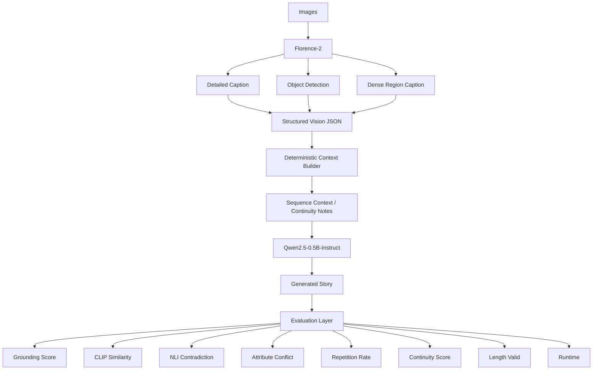
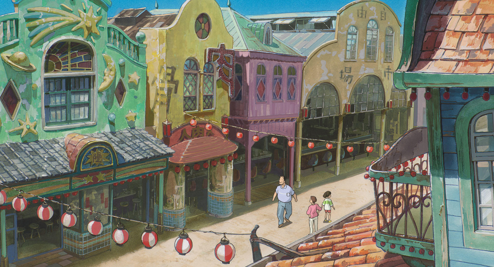
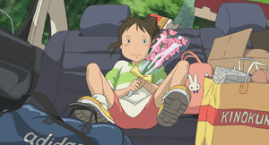
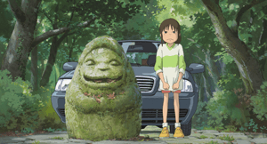
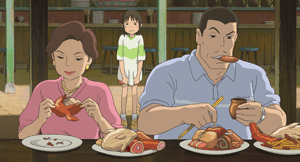
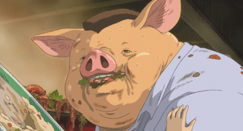
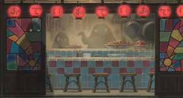
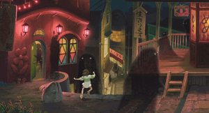

# Image -> Story

**Turn visual scenes into structured context, then structured context into coherent stories -- completely locally.**

A fully local multimodal pipeline that understands images, builds structured visual context, generates coherent stories, and automatically evaluates grounding, consistency, repetition, and runtime.

---

## Highlights

* 🖼️ **Local image understanding** -- Florence-2 with detailed caption, object detection, and dense region captioning
* 🧠 **Structured visual context** -- Deterministic JSON with scene, characters, objects, actions, spatial relations, and region descriptions
* 📖 **Multi-image story generation** -- Sequence-aware context builder with continuity notes across frames
* 📊 **Automated story evaluation** -- Grounding (CLIP + NLI + attribute conflict), repetition, continuity, length validation, runtime
* 🔒 **Fully local / offline inference** -- No hosted APIs; models download once and run on CPU

---

## Problem Statement

### The Baseline Bottleneck

```text
Image
  ↓
BLIP (Salesforce/blip-image-captioning-base)
  ↓
Single caption: "a girl sitting in the back of a car with a bunch of flowers"
  ↓
Qwen2.5-0.5B-Instruct
  ↓
Story
```

The language model never sees the image. It receives **one sentence** as its only visual signal. The result:

* **Missing objects** -- furniture, background details, text in scene
* **Incorrect attributes** -- caption says "man", story invents "golden retriever"
* **Contradictions** -- story describes coffee and bread when image shows hot dogs
* **Weak grounding** -- no visual evidence for generated narrative
* **Disconnected multi-frame stories** -- each image treated independently

---

## Project Goal

1. **Improve the image-understanding stage** -- replace single caption with structured visual extraction
2. **Build richer structured visual context** -- deterministic JSON populated only from model outputs
3. **Preserve information across multiple images** -- sequence context with recurring entities
4. **Generate a coherent story** -- prompt the LLM with organized facts, not raw descriptions
5. **Evaluate grounding and consistency** -- automatic metrics that measure what matters
6. **Keep everything runnable locally** -- offline, CPU-compatible, reproducible

Pipeline view:

**Image Understanding -> Structured Context -> Sequence Context -> Story Generation -> Evaluation**

---

## Architecture



### Components

| Component | Implementation | Role |
|-----------|----------------|------|
| **Vision** | `seeing.py` | Florence-2-base: `<MORE_DETAILED_CAPTION>`, `<OD>`, `<DENSE_REGION_CAPTION>` |
| **Context** | `context_builder.py` | Deterministic templates -> single-image & sequence prompts |
| **Story** | `baseline.py` + `main.py` | Qwen2.5-0.5B-Instruct (greedy, seed=0) |
| **Evaluation** | `metric.py` | CLIP ViT-B/32, NLI MiniLM2, deterministic checks |
| **Orchestration** | `main.py` | CLI: `--baseline`, `--improved`, `--both`, `--multi`, `--fix-length` |

---

## Why the Baseline Was Insufficient

The baseline compresses a photograph into **one sentence** before the story model sees it.

### From Single Caption -> Structured Visual Context

The implemented vision stage uses **Florence-2-base** with three tasks:

| Task | Purpose | Example Output |
|------|---------|----------------|
| `<MORE_DETAILED_CAPTION>` | Paragraph-level scene description | "The image is an illustration of a street scene in a European city. The street is lined with colorful buildings..." |
| `<OD>` | Object detection labels | `["building", "house", "window", "person"]` |
| `<DENSE_REGION_CAPTION>` | Region-level descriptions with bboxes | `["colorful buildings with Christmas decorations on street", "person", "window"]` |

### Structured Representation

```json
{
  "image_id": "chihiro003.jpg",
  "scene": "The image is an illustration of a street scene in a European city",
  "description": "The image is an illustration of a street scene in a European city. The street is lined with colorful buildings...",
  "objects": ["building", "house", "window", "colorful buildings with Christmas decorations on street", ...],
  "characters": ["person", "children", "man"],
  "actions": ["walking"],
  "relationships": [],
  "ocr_text": "",
  "spatial_relations": [],
  "region_descriptions": [
    "colorful buildings with Christmas decorations on street",
    "colorful building with Christmas lanterns and decorations",
    "colorfully painted buildings with red lanterns on street",
    ...
  ],
  "style_or_mood": "playful",
  "runtime_s": 18.5,
  "model_load_s": 11.1
}
```

**Fields are populated only when supported by the model output** -- no hallucinated fields.

---

## Context Builder

`context_builder.py` converts structured vision JSON into a concise, deterministic prompt for the story model.

### Single-Image Mode
```
Scene: The image is an illustration of a street scene in a European city.
Characters: person, children, man.
Objects: building, house, window, colorful buildings with Christmas decorations on street, ...
Actions: walking.
Region: colorful buildings with Christmas decorations on street.
Region: colorful building with Christmas lanterns and decorations.
Style: playful.
```

### Sequence Mode (Multi-Image)

```
SEQUENCE OF IMAGES (in order):
--- IMAGE 1 (chihiro003.jpg) ---
Location: The image is an illustration of a street scene in a European city
Characters: person, children, man
Objects: building, house, window
Actions: walking
Detail: colorful buildings with Christmas decorations on street
Detail: colorful building with Christmas lanterns and decorations
Mood: playful

--- IMAGE 2 (thumb-chihiro001.png) ---
Location: The image shows a young boy sitting in the back seat of a car
Characters: girl, boy, human
Objects: footwear, human face, person
Actions: sitting, wearing, holding
Detail: A young girl sitting on the back seat of a car with a bunch of flowers.
Detail: A young boy sitting on a couch with a bouquet of flowers in his hand.

--- CONTINUITY NOTES ---
Recurring characters: person, children, man, girl, boy, human
Recurring locations: street, city, car
Recurring objects: building, house, window, footwear, human face, person
Maintain character identity and location consistency across frames.
Connect events naturally; do not reset the story at each image.
```

**The vision model extracts facts. The context builder organizes those facts. The story model turns them into narrative.**

---

## Multi-Image Story Generation

```text
Image 1 -> Context 1 ─┐
Image 2 -> Context 2 ─┤
Image 3 -> Context 3 ─┤
...                  ├-> Sequence Context -> Story
Image N -> Context N ─┘
```

The goal: a connected narrative across frames, not independent mini-stories per image.

**Current limitations:** The 0.5B model struggles with long sequence prompts; continuity metrics show room for improvement.

---

## Evaluation (Module 10)

Evaluation is a first-class part of the pipeline. Every `(image, context, story)` tuple is scored automatically.

| Metric | What It Measures | Direction | Implementation |
|--------|------------------|-----------|----------------|
| **Grounding Score** | Composite: visual alignment + consistency + attribute accuracy | Higher | `0.4*clip_n + 0.4*(1-nli_contra_mean) + 0.2*(1-attr_conflict)` |
| **CLIP Similarity** | Image-story semantic similarity (ViT-B/32 cosine) | Higher | `clip((mean_cos - 0.15)/0.15, 0, 1)` |
| **NLI Contradiction** | Contradiction between **generated context** and story sentences | Lower | `cross-encoder/nli-MiniLM2-L6-H768` mean P(contradiction) |
| **Attribute Conflict** | Color/material words in story not present in context | Lower | Set difference per group (color, material) |
| **Repetition Rate** | Fraction of repeated trigrams in story | Lower | `repeated_trigrams / total_trigrams` |
| **Entity Consistency** | Fraction of recurring visual entities mentioned in story | Higher | `(recurring ∩ story_words) / recurring` |
| **Transition Markers** | Count of temporal words (then, next, after, later...) | Context | Lexicon lookup |
| **Adjacent Similarity** | Entity Jaccard between adjacent frame contexts | Context | Mean over adjacent pairs |
| **Length Valid** | Story within 80-120 word target range | Pass/Fail | Hard check |
| **Runtime** | End-to-end execution cost | Lower | Monotonic timers: `seeing_s`, `story_s`, `total_s` |

**`grounding_pass`** = `grounding_score ≥ 0.60` AND no attribute conflict AND `length_valid`.

> **Important:** NLI evaluates contradiction between the **story and the generated context/caption** — it measures *consistency with the extracted visual context*, not independent image verification. Only CLIP directly compares image to story. These are automatic proxies — not perfect human-quality measures.

### Evaluation Interpretation Table

| Evaluation Signal | Normal Baseline | Normal Improved | Fixlen Baseline | Fixlen Improved | Interpretation |
|-------------------|----------------|----------------|-----------------|----------------|----------------|
| Grounding Score   | 0.783          | **0.866**      | 0.756           | **0.789**      | Higher = stronger alignment |
| CLIP Similarity   | 0.233          | **0.258**      | 0.240           | **0.253**      | Higher = stronger image-story semantic similarity |
| NLI Contradiction | 0.098          | **0.055**      | 0.207           | **0.088**      | Lower = fewer textual contradictions with context |
| Repetition Rate   | 0.0034         | 0.0073         | 0.0068          | 0.0118         | Lower = less repeated phrasing |
| Entity Consistency| 1.000          | 1.000          | 1.000           | 1.000          | Higher = stronger cross-frame consistency |
| Length Valid      | 0/8            | **2/8**        | 6/8             | 6/8            | Requirement compliance |
| Grounding Pass    | 0/8            | **2/8**        | **5/8**         | 4/8            | Composite threshold |
| Runtime (total)   | 13.4 s         | 27.0 s         | 29.4 s          | 41.9 s         | Lower = more efficient |

> **Note:** NLI evaluates contradiction between the **story and the generated context/caption** — it measures *consistency with the extracted visual context*, not independent image verification. Only CLIP directly compares image to story. These are automatic proxies — not perfect human-quality measures.

---

## Baseline vs Improved Results

**8-image offline comparison** -- same images, same metric, same Qwen story model.

### Normal Mode (no length control)

| Metric | Baseline (BLIP) | Improved (Florence-2) | Delta |
|--------|-----------------|----------------------|-------|
| Mean Grounding Score | 0.783 | **0.866** | **+0.083** |
| Mean CLIP Similarity | 0.233 | **0.258** | **+0.025** |
| Mean NLI Contradiction | 0.098 | **0.055** | **-0.043** |
| Mean Repetition Rate | 0.0034 | 0.0073 | +0.0039 |
| Length Valid (80-120 words) | 0/8 | **2/8** | +2 |
| Grounding Pass | 0/8 | **2/8** | +2 |
| Mean Seeing Time | 4.3 s | 18.1 s | +13.8 s |
| Mean Story Time | 9.1 s | 8.8 s | -0.3 s |
| Mean Total Time | 13.4 s | 27.0 s | +13.6 s |

*Source: `results_new.csv` -- 8 images × 2 variants, run offline with `HF_HUB_OFFLINE=1`.*

### Length-Controlled Mode (`--fix-length`)

With `--fix-length`, both pipelines retry generation up to 3 times with stricter length prompts until the story falls in 80–120 words (or return the best attempt). This controls the length confound by applying the same length-control mechanism to both pipelines. It does not force identical word counts.

| Metric | Baseline (BLIP) | Improved (Florence-2) | Delta |
|--------|-----------------|----------------------|-------|
| Mean Grounding Score | 0.756 | **0.789** | **+0.033** |
| Mean CLIP Similarity | 0.240 | **0.253** | **+0.013** |
| Mean NLI Contradiction | 0.207 | **0.088** | **−0.119** |
| Mean Repetition Rate | 0.0068 | 0.0118 | +0.0050 |
| Length Valid (80-120 words) | 6/8 | 6/8 | 0 |
| Grounding Pass | **5/8** | 4/8 | −1 |
| Mean Seeing Time | 2.4 s | 17.4 s | +15.0 s |
| Mean Story Time | 27.0 s | 24.5 s | -2.5 s |
| Mean Total Time | 29.4 s | 41.9 s | +12.5 s |

*Source: `results_fixlen_new.csv` -- same 8 images, length-controlled, offline.*

**Key insight:** With length controlled, the grounding gain shrinks from +0.083 to +0.033, and baseline wins on grounding pass (5/8 vs 4/8) because both produce 6 valid-length stories but baseline scores higher on the ones that pass. The large normal-mode pass gain (+2 passes) was largely a length artifact. NLI contradiction is substantially reduced (−0.119) with the improved pipeline.

---

## Per-Image Evidence

| Image | Normal Δ | Fixlen Δ | Normal Assessment | Fixlen Assessment |
|-------|----------|----------|-------------------|-------------------|
| chihiro003.jpg | +0.065 | −0.193 | Improved: dense regions gave "man + two children walking", "colorful buildings with lanterns" | **Regressed**: longer context confused Qwen; story less coherent |
| thumb-chihiro001.png | −0.039 | −0.027 | Regressed: dense regions confused girl/boy; context noisier | Regressed: gender confusion in dense regions |
| thumb-chihiro002.png | +0.239 | +0.179 | **Improved**: OD+dense corrected "woman on rock" → "girl + monster statue" | **Improved**: correction persists |
| thumb-chihiro004.png | −0.061 | −0.044 | Regressed: dense regions added false "dog" and "hot dog" | Regressed: false "dog" detection persists |
| thumb-chihiro005.png | +0.121 | +0.113 | **Improved**: detailed caption corrected "man in suit" → "boy with green hair" | **Improved**: correction persists |
| thumb-chihiro006.png | −0.014 | −0.035 | Slight regress: both reasonable | Slight regress |
| thumb-chihiro007.png | +0.120 | +0.133 | **Improved**: dense regions gave "lantern, stool, bowl, bird" | **Improved**: consistent gain |
| thumb-chihiro008.png | +0.230 | +0.133 | **Improved**: detailed caption corrected "town + dog" → "video game screenshot" | **Improved**: gain persists but smaller |

**Normal mode:** Improvements on 5/8 images. Largest gains on 002 (+0.239), 008 (+0.230), 005 (+0.121), 007 (+0.120), 003 (+0.065). Regressions on 3/8 images: 001 (−0.039), 004 (−0.061), 006 (−0.014).

**Fixlen mode:** Improvements on 4/8 images (002, 005, 007, 008). Regressions on 4/8 images: 001, 003, 004, 006. The grounding gain is real but smaller (+0.033 vs +0.083). Baseline wins on grounding pass (5/8 vs 4/8) when length is controlled, even though length-valid is tied at 6/8 each.

---

## Key Finding

> **Florence-2's structured visual extraction (detailed caption + OD + dense regions) raises grounding score by +0.083 normally and +0.033 when length is controlled, while substantially reducing NLI contradiction (−0.043 normal, −0.119 fixlen). In normal mode, grounding improved on 5/8 images and regressed on 3/8; in length-controlled mode, improved and baseline each win on 4/8 images, and baseline wins on grounding pass (5/8 vs 4/8) because both produce 6 valid-length stories. The single-sentence BLIP bottleneck is real and the richer visual representation helps on average, but Florence-2 introduces its own errors (false "dog", gender confusion) and the small Qwen model struggles to integrate longer contexts under length constraints.**

**Runtime tradeoff:** Seeing cost increases ~4–7× (4.3 s → 18.1 s/image normal; 2.4 s → 17.4 s fixlen). Story generation remains similar in normal mode (~9 s); fixlen multiplies story time ~3× due to retries. Total pipeline ~2× slower normal, ~1.4× slower fixlen.

---

## Failure Cases & Limitations

| Failure Mode | Observed In | Impact |
|--------------|-------------|--------|
| **Gender confusion** | thumb-chihiro001.png | Dense regions output both "girl" and "boy" for same figure |
| **False object detection** | thumb-chihiro004.png | Dense regions add "dog" not present in image |
| **Incorrect scene interpretation** | thumb-chihiro008.png | Detailed caption calls frame "video game screenshot" and adds sword |
| **Length control failure** | 6/8 improved stories | Qwen 0.5B cannot reliably hit 80-120 words (range: 36-118 normal; 75-120 fixlen) |
| **Weak sequence coherence** | Multi-image story | 0.5B model cannot maintain long-range narrative continuity |
| **Increased vision latency** | All improved runs | 3 Florence-2 tasks vs 1 BLIP call |
| **Context confusion (fixlen)** | chihiro003.jpg fixlen | Longer structured context confused small Qwen model |

### Concrete Baseline Failures (Evidence)

**FAILURE 1: Hallucinated Attribute (chihiro003.jpg)**
- **Baseline caption:** "a painting of a street scene with a man walking down the street"
- **Baseline story claim:** "He's dressed in a casual yet stylish outfit, a pair of jeans and a t-shirt that shows off his muscular build"
- **Observed issue:** The caption mentions only "a man" — no jeans, no t-shirt, no muscular build. The story invents specific clothing and physique.
- **Metric signal:** Grounding 0.740, CLIP 0.219 (low), NLI 0.111 (moderate). Partially caught by low CLIP and elevated NLI.

**FAILURE 2: Hallucinated Object Class (thumb-chihiro008.png)**
- **Baseline caption:** "a scene of a town with a man and a dog"
- **Baseline story claim:** "The dog, a golden retriever, wagged its tail in greeting"
- **Observed issue:** The caption says "a dog" — the story invents the specific breed "golden retriever". The image shows a video game scene with a figure holding a sword; no dog is clearly visible.
- **Metric signal:** Grounding 0.746, CLIP 0.213 (low), NLI 0.059. Weakly caught by low CLIP.

**FAILURE 3: Generic Hallucination from Underspecified Caption (thumb-chihiro007.png)**
- **Baseline caption:** "a restaurant with a table and chairs"
- **Baseline story claims:** coffee, bread, waiter, conversation, cozy atmosphere
- **Observed issue:** The caption gives only "restaurant + table + chairs". The story invents an entire dining scene with no visual basis.
- **Metric signal:** Grounding 0.787, CLIP 0.249, NLI 0.191 (high contradiction). Partially caught by high NLI contradiction.

### Regression Analysis (Images Where Improved < Baseline)

| Image | Cause | Evidence |
|-------|-------|----------|
| thumb-chihiro001.png | Gender confusion in dense regions | Dense regions: "girl sitting..." AND "boy sitting..." |
| thumb-chihiro004.png | False "dog" detection | Dense regions add "dog"; characters list includes "dog" |
| thumb-chihiro006.png | Both reasonable; improved slightly shorter | Baseline: pig painting; Improved: pig in kitchen |
| chihiro003.jpg (fixlen) | Longer context confused small Qwen | Fixlen: baseline 0.800 → improved 0.607 |

### Improvement Analysis (Strongest Gains)

| Image | Normal Δ | Fixlen Δ | Reason |
|-------|----------|----------|--------|
| thumb-chihiro002.png | +0.239 | +0.179 | Corrected "woman on rock" → "girl + monster statue" |
| thumb-chihiro008.png | +0.230 | +0.133 | Corrected "town + dog" → "video game screenshot" |
| thumb-chihiro007.png | +0.120 | +0.133 | Dense regions gave "lantern, stool, bowl, bird" |
| thumb-chihiro005.png | +0.121 | +0.113 | Corrected "man in suit on ledge" → "boy on balcony" |

**A richer context is only useful if the underlying vision information is accurate.**

---

## Example Output

### Input
```
chihiro003.jpg
```

### Visual Context (Improved)
```
Scene: The image is an illustration of a street scene in a European city.
Characters: person, children, man.
Objects: building, house, window, colorful buildings with Christmas decorations on street, ...
Actions: walking.
Region: colorful buildings with Christmas decorations on street.
Region: colorful building with Christmas lanterns and decorations.
Style: playful.
```

### Generated Story (Improved)
> In the vibrant streets of a European city, a group of children played under the twinkling Christmas lights. A man, dressed in a festive suit, walked down the street, his eyes sparkling with excitement as he passed by the colorful buildings adorned with Christmas decorations. The children watched, their faces lit up by the cheerful cheer of the adults around them.

*61 words -- grounding: 0.805, CLIP: 0.232, NLI: 0.032*

---

## Visual Examples

### Challenge Images with Generated Stories (8 frames from *Spirited Away*)

All 8 evaluation images are included in the `images/` folder. Run the full comparison:

```powershell
python main.py images/ --both --output results.csv
```

---

### 1. chihiro003.jpg — Street scene, European city

<p align="center">
  
</p>

| Pipeline | Grounding | Words | Story |
|----------|-----------|-------|-------|
| **Baseline (BLIP)** | 0.740 | 71 | A man steps out onto the bustling street, his footsteps echoing through the concrete. He's dressed in a casual yet stylish outfit, a pair of jeans and a t-shirt that shows off his muscular build. The sun is shining brightly, casting a warm glow over the cityscape below. The man's eyes are fixed on the sidewalk, looking for something to grab. He's walking slowly, taking his time to enjoy the moment. |
| **Improved (Florence-2)** | 0.805 | 61 | In the vibrant streets of a European city, a group of children played under the twinkling Christmas lights. A man, dressed in a festive suit, walked down the street, his eyes sparkling with excitement as he passed by the colorful buildings adorned with Christmas decorations. The children watched, their faces lit up by the cheerful cheer of the adults around them. |

---

### 2. thumb-chihiro001.png — Girl/boy in car with flowers

<p align="center">
  
</p>

| Pipeline | Grounding | Words | Story |
|----------|-----------|-------|-------|
| **Baseline (BLIP)** | 0.856 | 45 | A girl sat in the back of a car, surrounded by colorful flowers. The sun shone through the window, casting a warm glow on her face. She was lost in thought as she gazed at the vibrant blooms, feeling grateful for the beauty around her. |
| **Improved (Florence-2)** | 0.817 | 66 | In the heart of a bustling city, a young girl sat in the back seat of a sleek, modern car, her eyes fixed on the vibrant blooms around her. She held the bouquet in one hand, her fingers tracing the delicate petals with practiced ease. The scene was captured by a camera lens, capturing the essence of a moment that would soon be shared with others. |

---

### 3. thumb-chihiro002.png — Girl + monster statue in forest

<p align="center">
  
</p>

| Pipeline | Grounding | Words | Story |
|----------|-----------|-------|-------|
| **Baseline (BLIP)** | 0.644 | 47 | A woman sits alone on a rocky outcropping, gazing out at the car that drives by. The sun sets over the horizon, casting long shadows across the landscape. She takes a deep breath, feeling the cool breeze on her face as she watches the world pass by. |
| **Improved (Florence-2)** | 0.883 | 75 | In the heart of the dense forest, a young girl stood beside a large green monster statue, her eyes sparkling with excitement. She wore a simple green dress and a pair of sturdy boots, her laughter echoing through the trees. The car was parked nearby, its headlights casting long shadows on the ground. The scene was a stark contrast to the serene beauty of the forest, but the girl's presence was a joy to behold. |

---

### 4. thumb-chihiro004.png — Family meal in restaurant

<p align="center">
  
</p>

| Pipeline | Grounding | Words | Story |
|----------|-----------|-------|-------|
| **Baseline (BLIP)** | 0.895 | 30 | A man and woman sit at a table, sipping on coffee and savoring their meal. The aroma of freshly baked bread fills the air as they chat about their day. |
| **Improved (Florence-2)** | 0.834 | 80 | In the bustling restaurant, the family sat at a table, their faces lit by the warm glow of the restaurant's lights. The man, with his rugged mustache and sharp eyes, was savoring a hot dog, while the woman, with her gentle demeanor, watched with a curious gaze. The child, nestled between them, was munching on a red fish, its vibrant colors adding to the din. The scene was one of joy and companionship, as the family enjoyed their meal together. |

---

### 5. thumb-chihiro005.png — Green-haired boy on balcony

<p align="center">
  
</p>

| Pipeline | Grounding | Words | Story |
|----------|-----------|-------|-------|
| **Baseline (BLIP)** | 0.722 | 50 | A man in a formal suit and tie stands on a ledge, looking out over a cityscape. The sun glints off his polished leather jacket, casting a warm glow on his face. He takes a deep breath, feeling the tension in his muscles as he prepares to make a statement. |
| **Improved (Florence-2)** | 0.843 | 53 | In a serene garden, a young man with green hair stands on a red railing, his eyes fixed on the distant balcony. He holds a small, delicate bird in his hand, its wings fluttering gently as it watches the world below. The scene is peaceful, filled with a sense of tranquility and beauty. |

---

### 6. thumb-chihiro006.png — Pig in kitchen with food

<p align="center">
  
</p>

| Pipeline | Grounding | Words | Story |
|----------|-----------|-------|-------|
| **Baseline (BLIP)** | 0.878 | 58 | A pig, with its long snout and bushy tail, was painting a picture of a man in a field. The pig's eyes were fixed on the figure, his brush strokes soft and gentle. The man's face was serene, his expression calm and composed. The pig's artistry was evident in every stroke, capturing the essence of the man's presence. |
| **Improved (Florence-2)** | 0.864 | 47 | In a vibrant world, a pig with a blue shirt stands proudly, its eyes twinkling with mischief. It holds a green leafy vegetable in its mouth, its fur shimmering under the sun. In the background, a leafy tree casts a golden glow, adding to the lively scene. |

---

### 7. thumb-chihiro007.png — Chinese restaurant entrance

<p align="center">
  
</p>

| Pipeline | Grounding | Words | Story |
|----------|-----------|-------|-------|
| **Baseline (BLIP)** | 0.787 | 76 | In the dimly lit restaurant, the soft glow of the overhead light bathed the tables in a warm, inviting light. The air was filled with the scent of freshly baked bread and the aroma of steaming coffee. A friendly waiter greeted each patron with a warm smile, and the conversation flowed effortlessly as they sipped their coffee and ate their meals. The atmosphere was cozy and welcoming, perfect for a special occasion or a casual dinner. |
| **Improved (Florence-2)** | 0.907 | 118 | In the heart of the bustling city, amidst the vibrant lights and laughter, a cozy Chinese restaurant stood as a beacon of warmth and tradition. The entrance was adorned with twinkling lanterns that cast a gentle glow over the tables. A wooden stool sat gracefully in the center, its legs resting on a sturdy chair, while a bird perched on a branch nearby, its feathers shimmering under the soft glow of the lantern. The air was filled with the sweet aroma of steaming hot food and the melodious tunes of traditional Chinese music playing softly in the background. This scene captured the essence of a welcoming and festive atmosphere, perfect for a memorable meal or a warm conversation. |

---

### 8. thumb-chihiro008.png — Night town, video game style

<p align="center">
  
</p>

| Pipeline | Grounding | Words | Story |
|----------|-----------|-------|-------|
| **Baseline (BLIP)** | 0.746 | 76 | In the heart of a bustling town, a man sat on a bench, his eyes fixed on a distant dog. The dog, a golden retriever, wagged its tail in greeting. The man's face lit up as he watched the dog play with a toy, its tail swishing back and forth. The dog, in turn, wagged its tail back and forth, its eyes sparkling with joy. The man smiled, feeling grateful for the simple bond between them. |
| **Improved (Florence-2)** | 0.975 | 36 | In a small, dimly lit room, a figure stood before a small red building with a green door and red lights. The figure wore a dark cloak and held a small red building in her hands. |

---

## Model Stack

| Component | Model |
|-----------|-------|
| Baseline vision | `Salesforce/blip-image-captioning-base` |
| Improved vision | `florence-community/Florence-2-base` |
| Story generation | `Qwen/Qwen2.5-0.5B-Instruct` |
| Image-story similarity | `openai/clip-vit-base-patch32` |
| Contradiction evaluation | `cross-encoder/nli-MiniLM2-L6-H768` |

Models are downloaded once via `download_models.py` and cached locally. Inference runs entirely on CPU.

---

## Fully Local & Offline

> **No OpenAI, Gemini, Claude, Groq, Together, or other hosted inference API is required at runtime.**

```powershell
# One-time download (needs internet)
pip install -r requirements.txt
python download_models.py

# Offline execution
$env:HF_HUB_OFFLINE = "1"
$env:TRANSFORMERS_OFFLINE = "1"

# Run pipeline
python main.py images/ --both --output results.csv
```

---

## Installation

### Requirements
* Python 3.10+
* Windows / Linux / macOS (tested on Windows 11, CPU-only)
* ~8 GB RAM for model weights

### Setup
```bash
# Clone and install
git clone <this-repo>
cd image-to-story
pip install -r requirements.txt

# Download models (one-time, needs internet)
python download_models.py
```

### Offline Configuration
```powershell
# PowerShell
$env:HF_HUB_OFFLINE = "1"
$env:TRANSFORMERS_OFFLINE = "1"
```

```bash
# bash / zsh
export HF_HUB_OFFLINE=1
export TRANSFORMERS_OFFLINE=1
```

---

## Usage

### CLI Options (`main.py`)

| Flag | Description |
|------|-------------|
| `--baseline` | Run BLIP -> Qwen pipeline only |
| `--improved` | Run Florence-2 -> Qwen pipeline only |
| `--both` | Run both and compare (default if no mode flag) |
| `--multi` | Generate single story across all input images |
| `--fix-length` | Enforce 80-120 word limit with retries |
| `--output FILE` | Output CSV path (default: `results.csv`) |
| `--vision-json FILE` | Output vision JSON path (default: `vision.json`) |

### Commands

**Full comparison (baseline vs improved):**
```powershell
python main.py images/ --both --output results.csv
```

**Length-equalised comparison:**
```powershell
python main.py images/ --both --fix-length --output results_fixlen.csv
```

**Improved pipeline only:**
```powershell
python main.py images/ --improved
```

**Multi-image continuous story:**
```powershell
python main.py images/ --multi
```

---

## Evaluation Commands

```bash
# Self-test with synthetic strings (verifies metrics work)
python metric.py

# Run lightweight test suite (11 tests)
python test_pipeline.py
```

**Test coverage:** word-count validation, grounding calculation, repetition detection, continuity scoring, attribute conflict detection, context builder (single + sequence), JSON schema validation, CSV I/O, error handling, reproducibility config.

---

## Project Structure

```text
.
├── main.py                      # Unified CLI entry point
├── seeing.py                    # Florence-2 vision stage (3 tasks)
├── context_builder.py           # Deterministic context construction
├── metric.py                    # Evaluation: CLIP, NLI, repetition, continuity, runtime
├── baseline.py                  # BLIP baseline + shared Qwen story generator
├── test_pipeline.py             # 11 lightweight unit/integration tests
├── download_models.py           # One-time model downloader
├── experiments.md               # Full experiment write-up
├── results_new.csv              # 8-image comparison results
├── results_new_vision.json      # Structured vision output for all images
├── combined_story.json          # Multi-image story output
├── requirements.txt             # Pinned dependencies
└── README.md                    # This file
```

---

## Reproducibility

* **Same images** used for baseline and improved runs (8 frames from *Spirited Away*)
* **Local models** -- no external API calls at inference time
* **Deterministic generation** -- greedy decoding, fixed seed (`SEED = 0`), `repetition_penalty=1.05`
* **Model versions pinned** in `requirements.txt` and `download_models.py`
* **Python 3.13**, `torch 2.13.0`, `transformers 5.15.0`, CPU-only
* **Offline verification** -- `HF_HUB_OFFLINE=1` works end-to-end after download

### Commands

```powershell
# One-time setup (needs internet)
pip install -r requirements.txt
python download_models.py

# Offline runs (PowerShell)
$env:HF_HUB_OFFLINE = "1"
$env:TRANSFORMERS_OFFLINE = "1"

# Full comparison (baseline vs improved) on all 8 images
python main.py images/ --both --output results_new.csv

# Length-equalised comparison
python main.py images/ --both --fix-length --output results_fixlen_new.csv

# Multi-image story (sequence)
python main.py images/ --multi

# Self-test (synthetic strings)
python metric.py
python test_pipeline.py
```

---

## Performance

| Stage | Baseline (normal) | Improved (normal) | Baseline (fixlen) | Improved (fixlen) |
|-------|-------------------|-------------------|-------------------|-------------------|
| Vision (per image) | 4.3 s | 18.1 s | 2.4 s | 17.4 s |
| Story generation | 9.1 s | 8.8 s | 27.0 s | 24.5 s |
| **Total (per image)** | **13.4 s** | **27.0 s** | **29.4 s** | **41.9 s** |

*Measured after model load, on CPU, Windows 11. Florence-2 runs 3 tasks (detailed caption + OD + dense regions) vs BLIP's 1 task. Fixlen multiplies story time ~3× due to retries.*

---

## Design Decisions

| Decision | Rationale |
|----------|-----------|
| **Structured JSON over large paragraph** | Enables deterministic context building, field-level inspection, and per-field evaluation |
| **Deterministic context builder** | Reproducible prompts; no ML in the middle; easy to debug |
| **Local models only** | Offline capability; no API costs; privacy; reproducibility |
| **CLIP + NLI + deterministic checks** | Complementary signals: semantic similarity, logical consistency, attribute accuracy |
| **Explicit runtime measurement** | Monotonic timers per stage; load time separated from inference |
| **Per-image analysis** | Aggregate means hide regressions; table shows exactly which images improved/worsened |
| **Preserve regression cases** | Honest reporting; failures teach more than averages |

---

## What This Project Demonstrates

### Computer Vision
* Multimodal image understanding
* Detailed captioning
* Object detection
* Dense region captioning
* Structured scene extraction

### Generative AI
* Local LLM inference (Qwen 0.5B)
* Context construction from structured data
* Prompt-driven story generation

### LLMOps / Evaluation
* Reproducible experiments
* Baseline vs improved comparison
* Grounding evaluation (CLIP + NLI + attributes)
* Contradiction analysis
* Quality metrics (repetition, continuity, length)
* Runtime measurement
* Regression analysis

### Software Engineering
* CLI with subcommands
* Deterministic components
* Validation & error handling
* Automated tests (11 tests)
* JSON/CSV artifacts
* Offline execution

---

## Final Takeaway

**A short image caption can become the information bottleneck for downstream story generation.** Richer structured visual context (detailed caption + object detection + dense regions) improves grounding and reduces contradiction on average. However, errors introduced during visual extraction -- false objects, gender confusion, misclassified scenes -- propagate into the final narrative and can cause regressions on specific images. **Evaluation is essential** to distinguish real improvement from noise.

---

*Image -> Story Challenge -- exploring how visual representation depth affects story grounding in a fully local multimodal pipeline.*